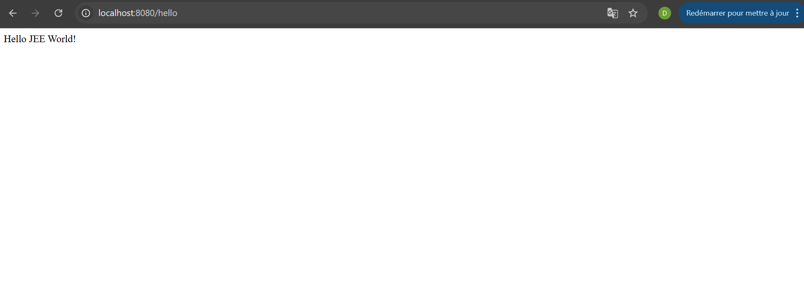
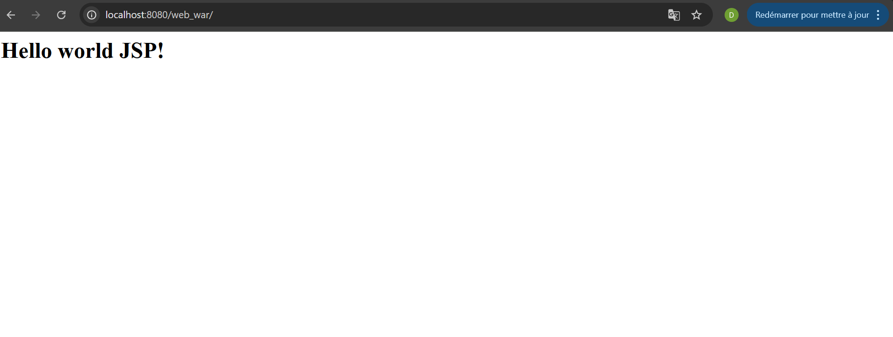
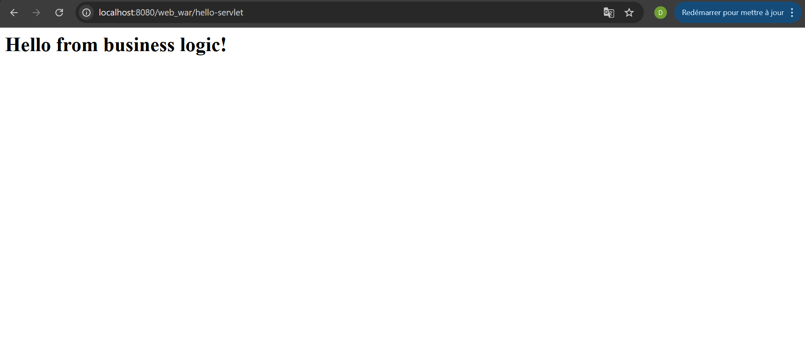
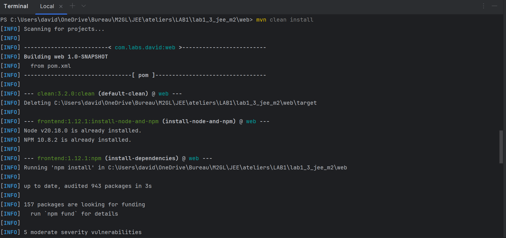
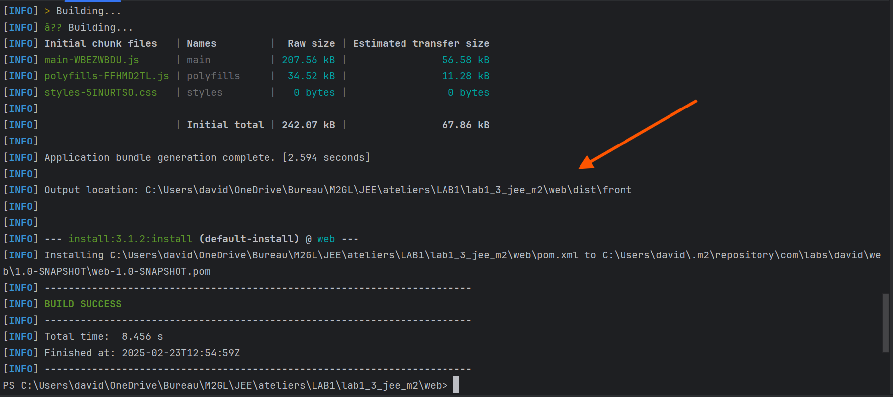
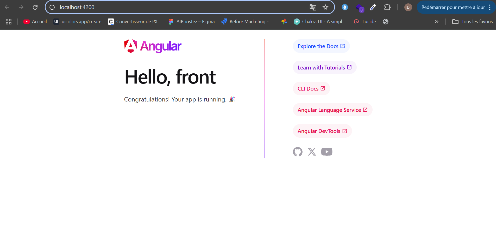

# **David GABIAM**

# Pratique maven

Ce projet permet de nous familiariser avec l'environnemt **Maven**.

## LAB1

- Nous allons créer un projet maven nommé commandes qui est un projet spring boot: projet parent
- Nous allons créer les modules maven suivants : services, web et start
- Le module services sera un projet qui gère le metier de l'application
- Le module web va gérer les controller
- Le module start est le projet de démarrage

   


## LAB2

- Nous allons créer un projet maven nommée commandes qui est un projet maven : projet parent
- Ensuite les modules maven suivants : services, web et batch
- Le module services sera un projet qui va gerer le metier de l'application
- Le module web est un projet tomcat
- Le module batch est un projet sping boot

  
  
  


## LAB3

- Nous allons créer un projet maven nommé commandes : projet parent
- Ensuite créer les modules maven suivants : services, web
- services sera un projet gere le metier de l'application
- web est une application angular

- On lance la commande pour builder le projet:
 ```sh
 mvn clean install
 ```
  
  
  
  
  
  

✍ **Auteur** : @mrDav90


